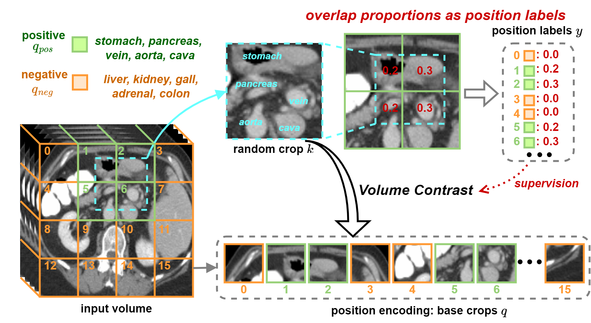
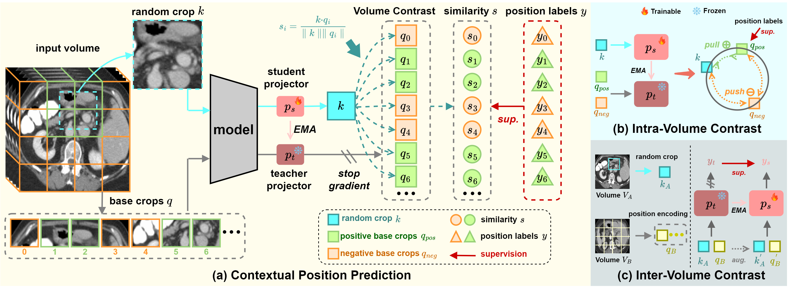
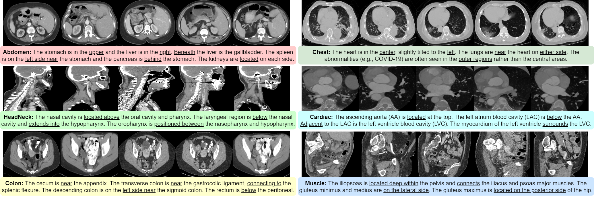
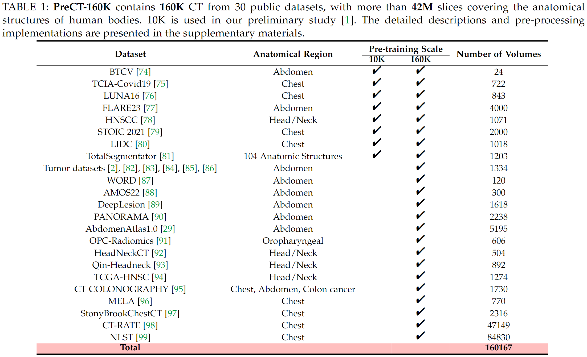

<div align="center">
<h1>Large-Scale 3D Medical Image Pre-training</h1>

<a href="https://github.com/Luffy03/Large-Scale-Medical"></a>
<a href="https://openaccess.thecvf.com/content/CVPR2024/html/Wu_VoCo_A_Simple-yet-Effective_Volume_Contrastive_Learning_Framework_for_3D_Medical_CVPR_2024_paper.html"></a>
<a href='https://huggingface.co/Luffy503/VoCo/tree/main'></a>
<a href='https://huggingface.co/datasets/Luffy503/PreCT-160K'></a>
</div>

<div align="center">
    
</div>

We observe that 3D medical images contain consistent geometric context, i.e., consistent geometric relations between different organs, which leads to a promising way for us to learn consistent representations in pre-training.
Motivated by this, we propose a simple-yet-effective **Vo**lume **Co**ntrast (**VoCo**) framework to leverage the geometric context priors for self-supervision. 
Specifically, we extract a group of base crops from different regions, aiming to construct positive and negative pairs for contrastive learning. Then we predict the contextual position of a random crop by contrasting its similarity with the base crops.
Through learning to predict contextual positions, VoCo implicitly encodes the inherent geometric relations into model representations, enabling us to learn high-level semantics without annotations.



## Pre-trained Models

| Model           | Params |                                           Checkpoint                                           |
|:----------------|-------:|:----------------------------------------------------------------------------------------------:|
| VoCo_B_SSL_head |    53M | [Download](https://huggingface.co/Luffy503/VoCo/resolve/main/VoCo_B_SSL_head.pt?download=true) |
| VoCo_L_SSL_head |   206M | [Download](https://huggingface.co/Luffy503/VoCo/resolve/main/VoCo_L_SSL_head.pt?download=true) |
| VoCo_H_SSL_head |   818M | [Download](https://huggingface.co/Luffy503/VoCo/resolve/main/VoCo_H_SSL_head.pt?download=true) |


## Pre-training

### Download Pre-training Dataset

Please refer to [Acknowledgment](#Acknowledgment). Download our  [PreCT-160K](https://huggingface.co/datasets/Luffy503/PreCT-160K) for pre-training.

The path of PreCT-160K should be organized as:
```
# or you can modify it in 'utils/data_utils*.py'
├── data
    ├── BTCV
    ├── TCIAcovid19
    ├── Luna16-jx
    ├── ...
    └── cache
```
**WARNING**: 
- It requires **22.6 TB** space to store the original datasets. For pre-training, it requires **30 TB** more space to cache the data, otherwise the pre-training will be very slow. And please store them in SSD.

Some cases:


Descriptions:



### Usage

```bash
cd Self-supervised
source activate YOUR-CONDA-ENVIRONMENT
# single GPU, if you don't have enough gpu resource
sh single_train
# multi-gpu
sh dist_B.sh
sh dist_L.sh
sh dist_H.sh
```


## Acknowledgement <a name="Acknowledgment"></a>

 **NOTE THAT** we are not the authors of these datasets. Although all these datasets are publicly available for academic research, you need to cite the original works as shown in our paper. For certain datasets (e.g., [WORD](https://github.com/HiLab-git/WORD)) that necessitate approval from the authors, you need to download it from the original link.

## Citation

If you find this repo useful for your research, please consider citing the paper as follows:

```bibtex
@InProceedings{voco-v1,
    author    = {Wu, Linshan and Zhuang, Jiaxin and Chen, Hao},
    title     = {VoCo: A Simple-yet-Effective Volume Contrastive Learning Framework for 3D Medical Image Analysis},
    booktitle = {CVPR},
    month     = {June},
    year      = {2024},
    pages     = {22873-22882}
}
```
